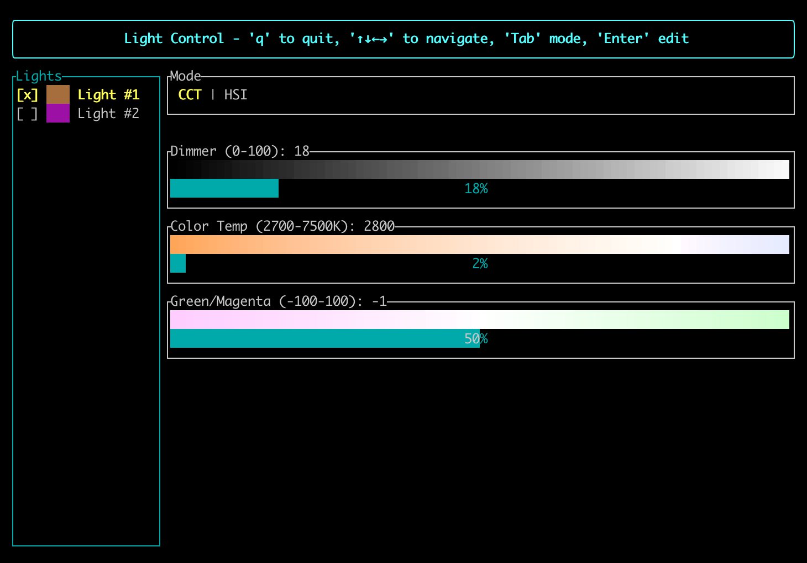
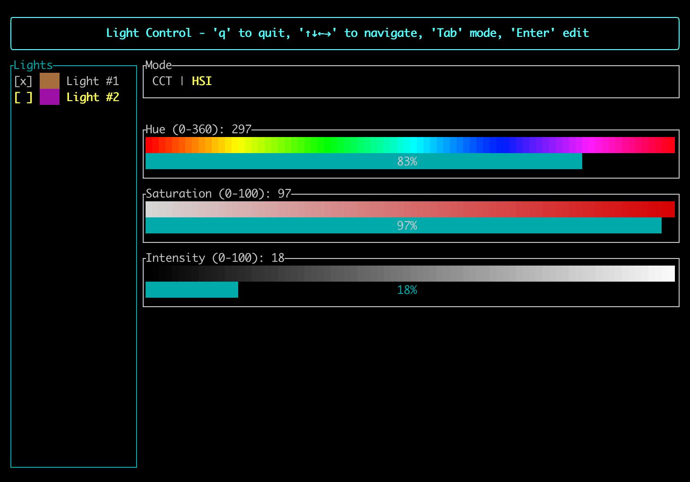
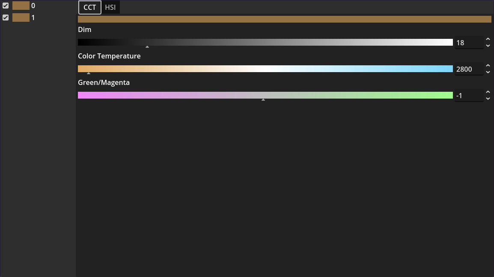
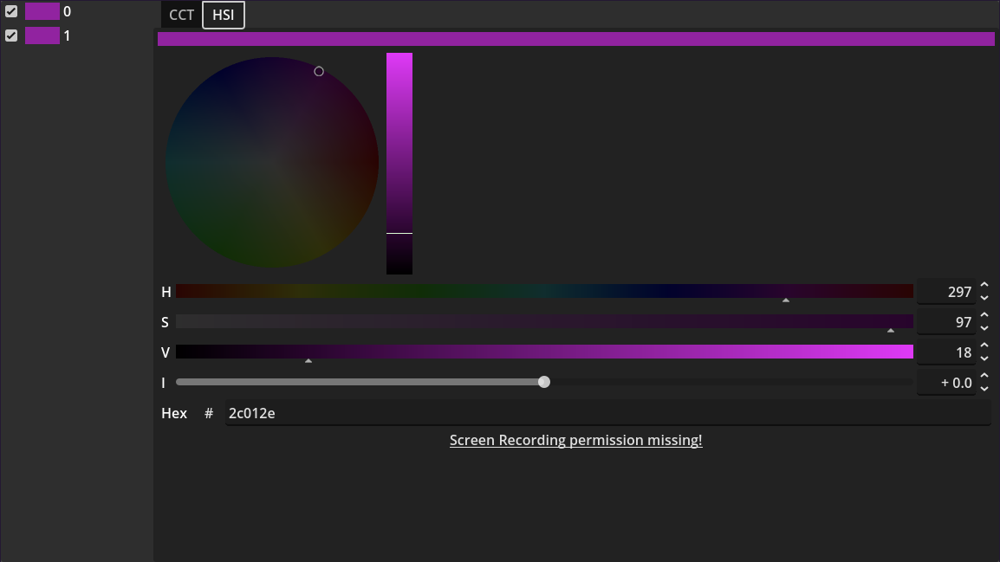

# Nanlite Light color

A TUI and Godot GUI for setting photography light colors and brightness, from a Raspberry Pi.

Currently supported: Nanlite Radio v1 protocol. This is used by at least the following devices:

- Nanlite PavoTubeII6C RGBWW (CCT and HSI mode)
- Nanlite FC-60B (CCT only)
- Nanlite FC-120B (CCT only)

(You might have to select the v1 radio protocol in the menu. The v2 protocol is not supported by this software)









## Hardware setup

The server component communicates with a NRF24L01+ module over SPI.

The wiring that was used during development is:

| nRF24 pin    | rPI pin      |
| :----------- | :----------- |
| 1 GND        | 20 Ground    |
| 2 VCC        | 17 3v3 power |
| 3 CE         | 22 GPIO 25   |
| 4 SPI CSN    | 24 GPIO 8    |
| 5 SPI SCK    | 23 GPIO 11   |
| 6 SPI MOSI   | 19 GPIO 10   |
| 7 SPI MISO   | 21 GPIO 9    |
| 8 IRQ        | N/A          |

The CE pin can be changed, if `nrf24_ce_gpio` in `config.json` is also updated. The other pins are wired internally to the rPI's SPI0 and should not be changed. The IRQ pin doesn't need to be connected as it is not used by this implementation.

You need to enable SPI in `/boot/firmware/config.txt`. That can be done using the `raspi-config` TUI, or by manually adding `dtparam=spi=on`.

## Server setup

The server component, `light-server` serves a JSONL protocol on a TCP port to allow client software to change the light colors.

It is configured using `config.json`, a JSON configuration file in the current directory:

```json
{
    "network": {
        "bind_addr": "0.0.0.0:4983"
    },
    "hardware": {
        "device": "/dev/spidev0.0",
        "nrf24_ce_gpio": 25
    },
    "lights": [
        { "address": 1 },
        { "address": 2 }
    ]
}
```

- `network`
  - `bind_addr`: Network address to bind to. Use `0.0.0.0:<port>` to bind on any interface, `127.0.0.1:<port>` for localhost only.
- `hardware`
  - `device`: SPI device node to use.
  - `nrf24_ce_gpio`: GPIO pin used for nRF24 Chip Enable.
- `lights`: Array of lights, with their address as configured on the Nanlite device.

## TUI client

The client can either be run locally, or connect to the server remotely over the network.

```
$ target/release/light-tui --help
Usage: light-tui [OPTIONS]

Options:
  -a, --address <ADDRESS>  Address of the light server [default: 127.0.0.1:4983]
  -h, --help               Print help
  -V, --version            Print version
```

## Godot client

To launch the godot client, open the `godot-gui` directory in the Godot 4 engine.

It is currently hardcoded to connect to `127.0.0.1:4983`. This can be changed as a property in `main.tscn`.

## Credits

- Mara van der Laan: Reverse engineering of Nanlite radio protocol, implementation
- Michal Hošna: rust nRF24 example, wiring suggestion
