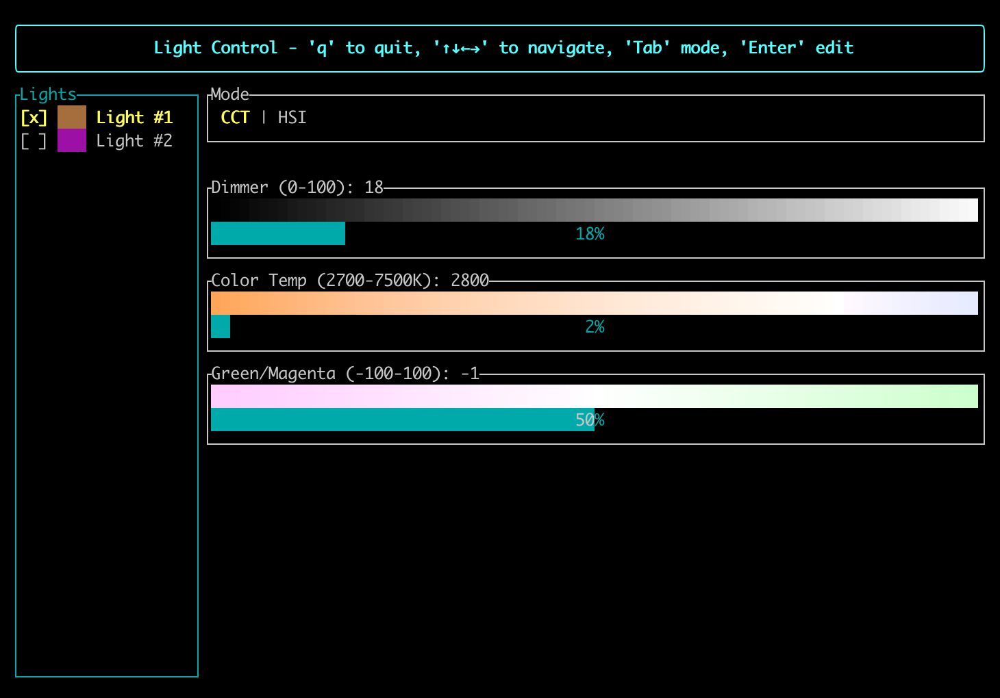
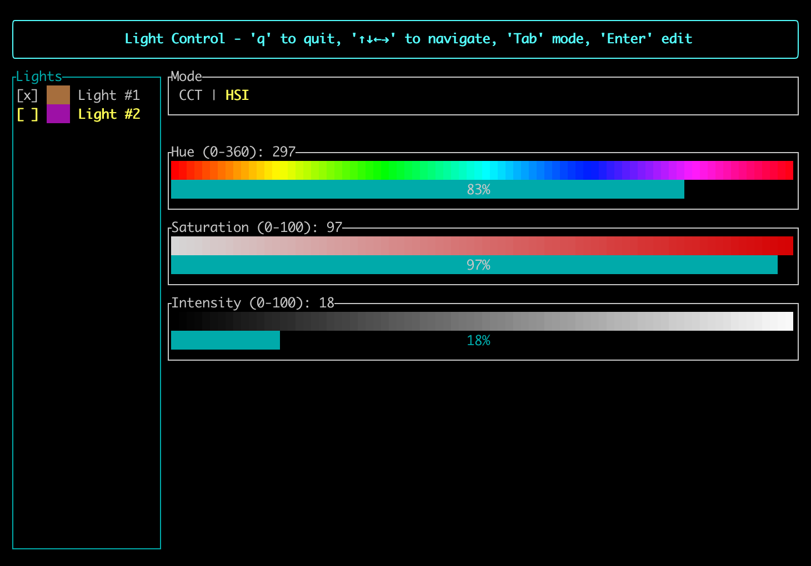
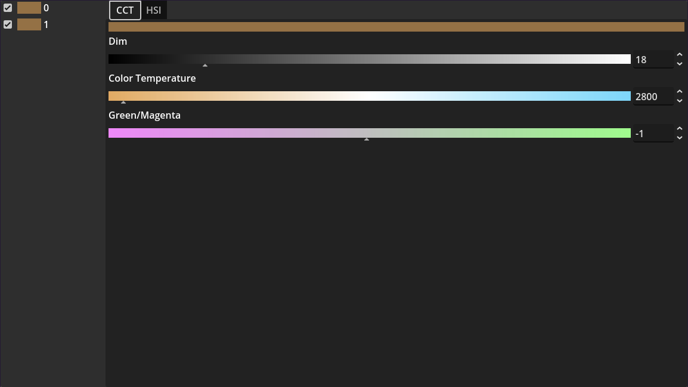
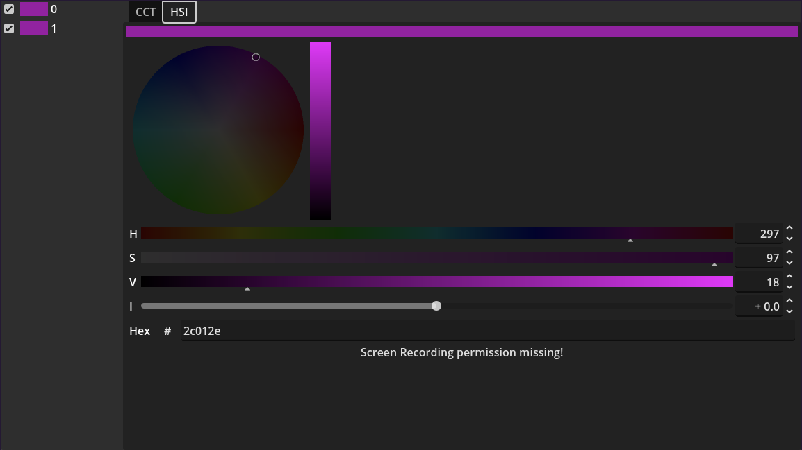

# Nanlite Light color

A TUI and Godot GUI for setting photography light colors and brightness, wirelessly from a Raspberry Pi.

Currently supported: Nanlite Radio v1 protocol. This is used by at least the following devices:

- Nanlite PavoTubeII6C RGBWW (CCT and HSI mode)
- Nanlite FC-60B (CCT only)
- Nanlite FC-120B (CCT only)

(You might have to select the v1 radio protocol in the menu. The v2 protocol is not supported by this software)









## Hardware setup

The server component communicates with a NRF24L01+ radio module over SPI.

The wiring that was used during development is:

```
rPi: Pinout from top of board, with raspi logo at top, connector will be at top right
("Pinout depicts pin 1 in the top left corner. Pin 1 is the only pin with a square
solder pad, which may only be visible from the underside of your Pi.")

nRF24: Module pinout from top of board, with antenna at the right.
(so pin header at bottom of board is swapped compared to this)


    ┌────────────────────────────────────────┐
    │                                        │
    │ ┌────────────────────────────────────┐ │
    │ │                                    │ │
    │ │     rPi                            │ │
    │ │ ╔════╦════╗                        │ │
    │ │ ║ 1  ║ 2  ║                        │ │
    │ │ ║ ■  ║ ●  ║                        │ │
    │ │ ╠════╬════╣                        │ │
    │ │ ┊    ┊    ┊              nRF24     │ │
    │ │ ╠════╬════╣           ╔════╦════╗  │ │
    │ │ ║ 17 ║ 18 ║           ║ 1  ║ 2  ║  │ │
    │ └───●  ║ ●  ║     ┌───────■  ║ ●─────┘ │
    │   ╠════╬════╣     │     ╠════╬════╣    │
    │   ║ 19 ║ 20 ║     │     ║ 3  ║ 4  ║    │
    └─────●  ║ ●────────┘ ┌─────●  ║ ●─────┐ │
        ╠════╬════╣       │   ╠════╬════╣  │ │
        ║ 21 ║ 22 ║       │   ║ 5  ║ 6  ║  │ │
    ┌─────●  ║ ●──────────┘ ┌───●  ║ ●─────│─┘
    │   ╠════╬════╣         │ ╠════╬════╣  │
    │   ║ 23 ║ 24 ║         │ ║ 7  ║ 8  ║  │
    │ ┌───●  ║ ●────────┐   │ ║ ●  ║ ●  ║  │
    │ │ ╠════╬════╣     │   │ ╚═│══╩════╝  │
    │ │ ┊    ┊    ┊     │   │   │          │
    │ │ ╠════╬════╣     │   │   │          │
    │ │ ║ 39 ║ 40 ║     └──────────────────┘
    │ │ ║ ●  ║ ●  ║         │   │
    │ │ ╚════╩════╝         │   │
    │ │                     │   │
    │ └─────────────────────┘   │
    │                           │
    └───────────────────────────┘
```

| nRF24 pin    | rPI pin      |
| :----------- | :----------- |
| `1` GND        | `20` Ground    |
| `2` VCC        | `17` 3v3 power |
| `3` CE         | `22` GPIO 25   |
| `4` SPI CSN    | `24` GPIO 8    |
| `5` SPI SCK    | `23` GPIO 11   |
| `6` SPI MOSI   | `19` GPIO 10   |
| `7` SPI MISO   | `21` GPIO 9    |
| `8` IRQ        | N/A          |

The CE pin can be changed, if `nrf24_ce_gpio` in `config.json` is also updated. The other pins are wired internally to the rPI's SPI0 and should not be changed. The IRQ pin doesn't need to be connected as it is not used by this implementation.

You need to enable SPI in `/boot/firmware/config.txt`. That can be done using the `raspi-config` TUI, or by manually adding `dtparam=spi=on`.

## Server setup

The server component, `light-server` serves a JSONL protocol on a TCP port to allow client software to change the light colors.

It is configured using a JSON configuration file specified with the `--config-file` argument:

```json
{
    "network": {
        "bind_addr": "0.0.0.0:4983"
    },
    "hardware": {
        "device": "/dev/spidev0.0",
        "nrf24_ce_gpio": 25
    },
    "lights": [
        { "address": 1 },
        { "address": 2 }
    ]
}
```

- `network`
  - `bind_addr`: Network address to bind to. Use `0.0.0.0:<port>` to bind on any interface, `127.0.0.1:<port>` for localhost only.
- `hardware`
  - `device`: SPI device node to use.
  - `nrf24_ce_gpio`: GPIO pin used for nRF24 Chip Enable.
- `lights`: Array of lights, with their address as configured on the Nanlite device.
  - `name` (optional): Display name for the light, used in MQTT discovery.

## MQTT / Home Assistant integration

The server can optionally connect to an MQTT broker and expose lights to
Home Assistant via [MQTT Discovery](https://www.home-assistant.io/integrations/mqtt/#mqtt-discovery).
Each light automatically appears as a light entity in HA with brightness,
color temperature, and HS color support.

### MQTT broker setup

You need an MQTT broker on your network. [Mosquitto](https://mosquitto.org/)
is the most common choice:

```bash
# Using Podman/Docker:
podman run -d --name mosquitto --network=host eclipse-mosquitto:2

# Or install natively:
apt install mosquitto
```

### Configuration

Add an `mqtt` section to the server config file:

```json
{
    "network": {
        "bind_addr": "0.0.0.0:4983"
    },
    "hardware": {
        "device": "/dev/spidev0.0",
        "nrf24_ce_gpio": 25
    },
    "lights": [
        { "address": 1, "name": "Key Light" },
        { "address": 2, "name": "Fill Light" }
    ],
    "mqtt": {
        "broker_addr": "192.168.1.100:1883",
        "topic_prefix": "nanlite"
    }
}
```

- `mqtt`
  - `broker_addr`: MQTT broker address in `host:port` format.
  - `username` / `password` (optional): Broker credentials.
  - `topic_prefix` (default `"nanlite"`): Prefix for all MQTT topics.

The `mqtt` section is optional. If omitted, the server runs without MQTT
(TCP-only, as before).

### Home Assistant setup

1. Install the [MQTT integration](https://www.home-assistant.io/integrations/mqtt/)
   in HA if not already present (**Settings > Devices & Services > Add Integration > MQTT**).
2. Point it at your MQTT broker.
3. Start `light-server` with the MQTT config. The lights will auto-discover
   in HA within a few seconds.

The lights appear under **Settings > Devices & Services > MQTT** and support:

- On/Off (mapped to brightness 0/100)
- Brightness (0-100)
- Color temperature (2700K-7500K, shown in mireds in HA)
- HS color mode (hue 0-360, saturation 0-100)

State changes from the TUI or Godot client are reflected in HA, and vice versa.

### MQTT topics

For a light at index `0` with topic prefix `nanlite`:

| Topic                                        | Direction       | Purpose                         |
| :------------------------------------------- | :-------------- | :------------------------------ |
| `homeassistant/light/nanlite_light_0/config` | server → broker | HA discovery payload (retained) |
| `nanlite/light/0/state`                      | server → broker | Current light state (retained)  |
| `nanlite/light/0/set`                        | broker → server | Commands from HA                |

## TUI client

The client can either be run locally, or connect to the server remotely over the network.

```
$ target/release/light-tui --help
Usage: light-tui [OPTIONS]

Options:
  -a, --address <ADDRESS>  Address of the light server [default: 127.0.0.1:4983]
  -h, --help               Print help
  -V, --version            Print version
```

## Godot client

To launch the godot client, open the `godot-gui` directory in the Godot 4 engine.

It is currently hardcoded to connect to `127.0.0.1:4983`. This can be changed as a property in `main.tscn`.

## Credits

- Mara van der Laan: Reverse engineering of Nanlite radio protocol, implementation
- Michal Hošna: rust nRF24 example, compact wiring suggestion
